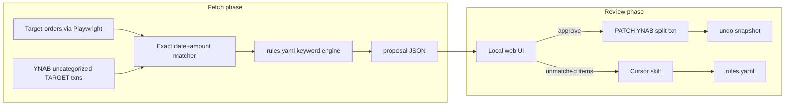

# Target → YNAB Auto-Categorizer (Grill Summary + Build Plan)

## Shared understanding (grill decisions locked)


| Decision       | Your choice                                                                               |
| -------------- | ----------------------------------------------------------------------------------------- |
| Entry point    | Bank imports lump-sum TARGET txns → scrape Target → match → split                         |
| Categorization | Keyword/regex rules first; Cursor skill for unmatched + growing rules                     |
| LLM location   | Cursor skill (not embedded API in tool)                                                   |
| Review UX      | Minimal local web UI                                                                      |
| Matching       | Exact date + exact amount (v1)                                                            |
| Scope          | Incremental: only since last successful run                                               |
| Bootstrap date | First run: auto from oldest uncategorized TARGET txn in YNAB; optional `--since` override |
| YNAB txn state | Uncategorized inbox transactions                                                          |
| Fees/discounts | Split tax/shipping evenly; RedCard discount mismatch OK; round to nearest dollar          |
| Apply          | Approve in web → immediate PATCH; easy undo via saved snapshots                           |


## Architecture




## Recommended stack

- **Python 3.11+** — Playwright for Target session scrape; `httpx` or official [ynab-sdk-js](https://github.com/ynab/ynab-sdk-js) equivalent in Python via direct REST calls (no official Python SDK; keep a thin client)
- **Playwright persistent auth** — one-time manual login → `auth/target.json` via `storage_state` (per your Target scraping context)
- **Web review** — FastAPI + single HTML page (no React). One route: list proposals; POST approve/undo
- **Config-as-code** — all tunables in plain files you edit by hand

## Config files (easy to change)

All under `[config/](config/)`:

- `**config.yaml**` — `ynab_token`, `budget_id` (or `"last-used"`), payee match pattern (e.g. `"TARGET"`), Target auth path, last-run state path
- `**categories.json**` — generated once via CLI; maps your YNAB category names → IDs. Re-run when you add/rename categories:
  ```bash
  python -m ynab_helper sync-categories
  ```
- `**rules.yaml**` — human-edited keyword rules:
  ```yaml
  rules:
    - pattern: "diaper|wipes|formula"
      category: "Baby"
    - pattern: "cheerios|milk|produce"
      category: "Groceries"
  fallback_category: "Shopping"
  ```

## Core commands (fewest features)


| Command           | Purpose                                                                                                                                                     |
| ----------------- | ----------------------------------------------------------------------------------------------------------------------------------------------------------- |
| `sync-categories` | Pull YNAB category list → `categories.json`                                                                                                                 |
| `fetch`           | Scrape Target since bootstrap/last-run date + pull uncategorized TARGET txns + match + categorize → write proposals. Supports `--since YYYY-MM-DD` override |
| `review`          | Start local web UI on `localhost:PORT` to approve splits                                                                                                    |
| `undo`            | Revert last N approved splits from undo snapshots (also exposed as button in web UI)                                                                        |


No other commands in v1.

## Matching + split math (naive, per your tolerance)

1. **Match**: Target order `(date, total)` ↔ YNAB txn `(date, abs(amount))` — exact only; unmatched orders/txns surface in web UI as separate lists
2. **Categorize line items**: first matching regex in `rules.yaml` wins; unmatched flagged for Cursor skill
3. **Split amounts** (handles RedCard discount imprecision):
  - Compute each line item's share of Target subtotal
  - Apply shares to the **actual YNAB transaction total** (what the bank posted)
  - Add tax/shipping/bag fees split evenly across categorized splits
  - Round each split to nearest **dollar** (1000 milliunits); remainder goes to largest split
4. **PATCH** to YNAB: replace single uncategorized txn with split subtransactions ([PATCH transaction API](https://api.ynab.com/))

## Web UI (minimal)

Single page, no auth (localhost only):

- **Matched pairs table**: order date, YNAB txn, proposed splits (item → category → $)
- **Per-order Approve** button → immediate PATCH + undo snapshot
- **Unmatched section**: Target orders with no YNAB match; YNAB txns with no Target match; uncategorized line items within matched orders
- **Undo** button (last apply) — restores pre-split txn from snapshot
- Visual flag when rounded splits differ from Target receipt by >$1 (informational only)

## Cursor skill (unmatched + rule learning)

New skill at `[.agents/skills/categorize-unmatched/SKILL.md](.agents/skills/categorize-unmatched/SKILL.md)`:

- Input: list of unmatched Target item names + your `categories.json` + current `rules.yaml`
- Output: suggested YNAB category per item + proposed regex rules to append
- You copy approved rules into `rules.yaml` (or skill edits file if you prefer)

Keeps the tool free of LLM API keys and makes tuning a conversational edit loop.

## Undo mechanism

Before each PATCH, save to `[data/undo/{txn_id}.json](data/undo/)`:

```json
{
  "transaction_id": "...",
  "original": { "amount": -87430, "category_id": null, "payee_name": "TARGET", "memo": "" },
  "applied_at": "2026-07-16T..."
}
```

Undo PATCHes back to `original`. Web UI exposes "Undo last"; CLI `undo --last 1` for scripting.

## Bootstrap date (first run)

Your instinct is right: **default to the oldest uncategorized TARGET transaction in YNAB** rather than asking you to pick a date upfront. The scrape window should match your actual backlog, not an arbitrary calendar guess.

**Resolution order on `fetch`:**

1. `**state.json` exists** → use `last_successful_run` (normal incremental runs)
2. **No state yet (first run)** → query YNAB for uncategorized txns matching payee pattern; take the **oldest `date`** as scrape start
3. **Manual override** → `--since YYYY-MM-DD` flag (or `initial_since` in `config.yaml`) wins over auto-bootstrap when provided

**Why this beats a manual initial date:**

- Zero config on first run — the tool discovers how far back it needs to go
- Target scrape window stays aligned with YNAB inbox backlog
- You only set a date if auto-bootstrap is wrong (e.g. you want to skip ancient txns)

**Edge cases:**

- **No uncategorized TARGET txns found** → print a clear message and exit; require `--since` if you still want to pre-scrape Target
- **Very old backlog** → first run may scrape many Target orders; acceptable since you only bootstrap once
- **Posting delay buffer** → not needed for v1 (exact date match); if a txn is dated 7/14 but order is 7/13, it surfaces as unmatched rather than silently wrong

On first successful run, persist `last_successful_run` to `state.json` and ignore bootstrap logic thereafter.

## Target scraper (minimal)

- Reuse saved session from `auth/target.json`
- Navigate order history; intercept JSON network responses (preferred over HTML scrape)
- Extract: order date, order total, line items (name, quantity, line price)
- Store raw scrape in `[data/target-orders/{order_id}.json](data/target-orders/)` for debugging
- Incremental: skip orders already in `[data/state.json](data/state.json)`
- Date window: from resolved bootstrap/last-run date through today

## State file

`[data/state.json](data/state.json)`:

```json
{
  "last_successful_run": "2026-07-16T21:00:00Z",
  "bootstrap_since": "2026-04-02",
  "processed_order_ids": ["..."],
  "processed_ynab_txn_ids": ["..."]
}
```

`bootstrap_since` is recorded on first run (whether auto-detected or overridden) for audit/debugging.

## Docs produced during design (grill-with-docs)

Since `/domain-modeling` skill is not installed, capture decisions inline:

- `[docs/glossary.md](docs/glossary.md)` — milliunits, split transaction, ready_to_assign, Target order vs YNAB txn, etc.
- `[docs/adr/001-match-and-split.md](docs/adr/001-match-and-split.md)` — entry point decision
- `[docs/adr/002-cursor-skill-for-unmatched.md](docs/adr/002-cursor-skill-for-unmatched.md)`
- `[docs/adr/003-exact-match-v1.md](docs/adr/003-exact-match-v1.md)`
- `[docs/adr/004-imprecise-split-math.md](docs/adr/004-imprecise-split-math.md)`
- `[docs/adr/005-ynab-bootstrap-date.md](docs/adr/005-ynab-bootstrap-date.md)` — auto-bootstrap from oldest uncategorized TARGET txn

## Explicit non-goals (v1)

- OAuth multi-user, hosted deployment, user accounts
- Fuzzy matching, manual pairing UI, returns/refunds automation
- Embedded LLM API calls
- Auto-syncing rules without your approval
- Budget/category allocation changes (only transaction splits)
- Fine-grained cent-level reconciliation with RedCard discounts

## Suggested repo layout

```
ynab-helper/
  config/config.yaml, categories.json, rules.yaml
  auth/target.json          # gitignored
  data/state.json, undo/, proposals/, target-orders/
  src/ynab_helper/
    cli.py
    target_scraper.py
    ynab_client.py
    matcher.py
    categorizer.py
    split_calculator.py
    web/app.py
  .agents/skills/categorize-unmatched/SKILL.md
  docs/glossary.md, docs/adr/
  pyproject.toml
  .env.example              # YNAB_TOKEN only
```

## Implementation order

1. **YNAB client + `sync-categories`** — validates token, produces `categories.json`
2. `**rules.yaml` + categorizer** — regex engine with fallback category
3. **Split calculator** — proportional + even fee split + dollar rounding
4. **Target scraper** — session auth + order JSON capture
5. **Matcher + `fetch`** — wire scrape + YNAB read + proposals
6. **Web review + PATCH + undo**
7. **Cursor skill for unmatched**
8. **Docs** (glossary + ADRs reflecting grill decisions)

## Open question resolved by grill

CLI vs web: **both, minimally** — CLI for fetch/sync/undo; web only for review/approve. This is the smallest surface that still gives you a visual grouping review.