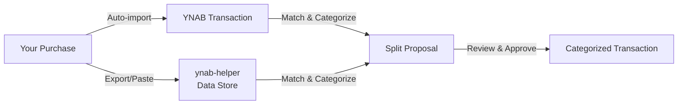

# ynab-helper

Match Target order line items to uncategorized YNAB transactions and propose split categorizations.

## Setup

```bash
# Install dependencies
uv sync

# Install Playwright browser
uv run playwright install chromium

# Copy and fill in your YNAB personal access token
cp .env.example .env
# Edit .env: YNAB_TOKEN=<your token>

# One-time: pull YNAB category list
uv run ynab-helper sync-categories

# One-time: log in to Target (opens browser for manual MFA)
uv run ynab-helper target-login
```

## Usage

```bash
# Scrape Target orders and save invoices locally
uv run ynab-helper fetch

# Match saved orders to YNAB and write proposals
uv run ynab-helper propose

# Review and approve splits in browser (localhost:8765)
# Auto-restarts on source edits; pass --no-reload to disable
uv run ynab-helper review

# Revert last approved split
uv run ynab-helper undo
```

### Fetch options

```bash
uv run ynab-helper fetch --since 2026-07-01   # override start date
uv run ynab-helper fetch --skip-scrape         # re-parse saved invoices only
uv run ynab-helper fetch --overwrite           # ignore last-run state, re-scrape
```

## Importing and Reviewing Orders

ynab-helper works in two steps:
1. **YNAB auto-imports** your transactions from connected accounts (RedCard, Costco, Amazon) or manual imports (PayPal CSV)
2. **ynab-helper imports** detailed order data, matches it to those transactions, and proposes categorizations



### Target: RedCard Purchases

```bash
# Step 1: RedCard transactions auto-import to YNAB from your bank

# Step 2a: Scrape Target orders (live)
uv run ynab-helper fetch [--since 2026-07-01]

# Step 2b: Or paste manually (if scraper is blocked or errors)
# Copy invoice page text and save to inbox/target_1.txt (or use pb_target alias)
# Then run: uv run ynab-helper import-invoices

# Step 3: Match orders to YNAB and propose categorizations
uv run ynab-helper propose
```

### PayPal: Exported CSV

```bash
# Step 1: Export Activity CSV from PayPal (Statements → Downloads)

# Step 2: Place CSV file in inbox/ and import
# Copy CSV file to inbox/paypal.csv (or any filename), then:
uv run ynab-helper import-invoices

# Step 3: Match records to YNAB and propose categorizations
uv run ynab-helper propose-paypal

# Or rebuild from scratch (after importing new CSV data):
uv run ynab-helper build-paypal-review
```

Note: "Bank Deposit to PP Account" rows are excluded (these are already in YNAB as transfers).

### Costco: Pasted Receipts

```bash
# Step 1: Costco account auto-imports to YNAB

# Step 2: Copy receipt text and import
# Copy receipt (Gas Station or In-Warehouse) and save to inbox/costco_1.txt
# (or use pb_costco alias), then:
uv run ynab-helper import-invoices

# Step 3: Match receipts to YNAB and propose categorizations
uv run ynab-helper propose --source costco
```

### Amazon: Pasted Order Confirmations

```bash
# Step 1: Amazon account auto-imports to YNAB

# Step 2: Copy order confirmation and import
# Copy order confirmation or invoice page and save to inbox/amazon_1.txt, then:
uv run ynab-helper import-invoices

# Step 3: Match orders to YNAB and propose categorizations
uv run ynab-helper propose --source amazon
```

Note: Quantity is signaled by a digit-only line before the item name (defaults to 1 if omitted).

## Configuration

- `config/config.yaml` — budget ID, payee match pattern (`TARGET`), file paths
- `config/categories.json` — generated by `sync-categories`; re-run when YNAB categories change
- `config/rules.yaml` — keyword regex → YNAB category mappings, plus `allowed_categories` (the subset of YNAB categories a Target split may target); edit to add rules. Patterns are case-insensitive, first-match-wins, and must be **single-quoted** — a double-quoted `\b` is parsed as a backspace escape and silently never matches.

## Categorization skill

Use the `categorize-unmatched` skill to review applied Target proposals against `config/rules.yaml` — manual corrections, wrong-category items, and rule gaps — and propose regex fixes for `config/rules.yaml`.

## Docs

- [Glossary](docs/glossary.md)
- [Architecture decisions](docs/adr/)
